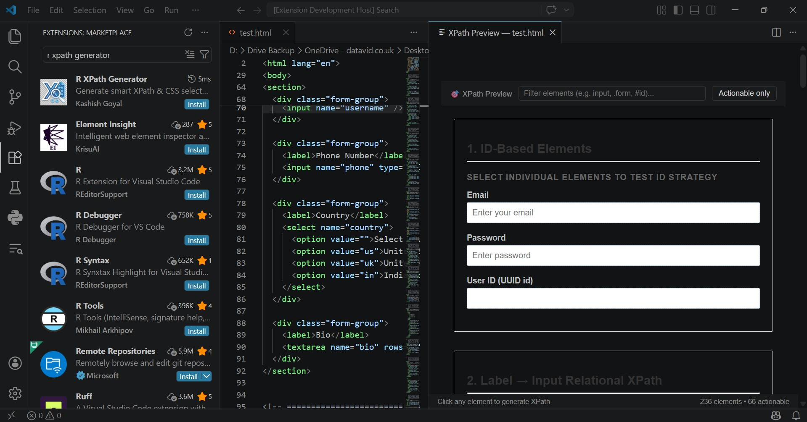
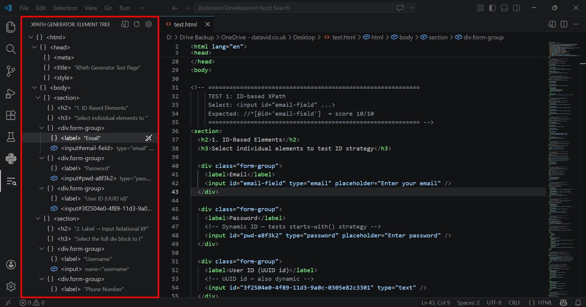
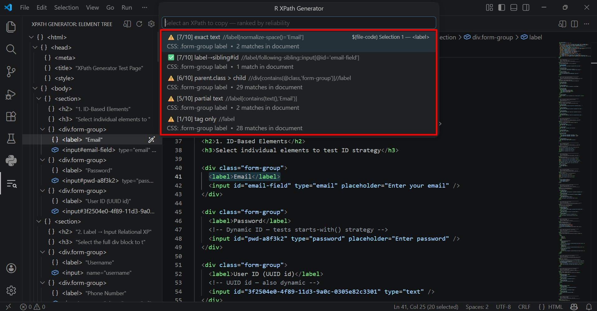
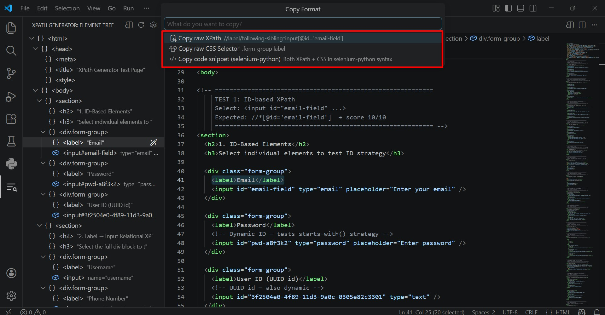

# R XPath Generator

> Generate smart, ranked XPath expressions and CSS selectors from HTML — with a visual preview panel, element tree sidebar, and framework-ready code snippets. Built for test automation engineers who live in VS Code.

---

## Screenshots

### Visual HTML Preview Panel


### Element Tree Sidebar


### Ranked XPath QuickPick


### Framework Code Snippet


---

## Why This Extension?

Browser DevTools are great for inspecting live pages — but when you're writing tests, you're already in your editor. This extension brings the **inspect-and-locate workflow directly into VS Code**:

- No need to spin up a browser just to find a locator
- Works on raw HTML, JSX, and TSX source files
- Generates multiple ranked strategies, not just one guess
- Outputs ready-to-paste code for your framework of choice

---

## Features

### 🎯 Visual HTML Preview Panel
Open any HTML file and click any element visually — just like browser DevTools, inside VS Code.

- Hover over elements to see a tooltip with all attributes
- Click any element to instantly generate ranked XPaths
- Filter bar to highlight elements by tag, class, or ID
- **Actionable only** toggle — dims divs and spans, highlights inputs, buttons and links

### 🌲 Element Tree Sidebar
A collapsible DOM tree in the VS Code activity bar showing every element in the open file.

- Structured exactly like the browser Elements panel
- Click any node to generate XPath and jump to that element in source
- Colour-coded icons for inputs, buttons, links, selects
- Auto-refreshes when you save the file

### 📊 Smart XPath Ranking
Every generated XPath is scored out of 10 based on reliability for test automation.

| Score | Strategy |
|---|---|
| 10/10 | Exact `@id` |
| 9/10 | `data-testid`, `data-cy`, `data-qa`, `data-test` |
| 8/10 | `@name`, `type+name` combo, parent `#id` → child |
| 7/10 | `@placeholder`, `@aria-label`, exact text match |
| 6/10 | `@href`, `@alt`, `@role`, parent class → child |
| 5/10 | Partial text, `@type` only, other `data-*` |
| 4/10 | Class-based |
| 2/10 | Positional `[n]` |
| 1/10 | Tag only (fallback) |

### 🔗 Relational XPath Strategies
Automatically generates label→input sibling patterns — the most robust locators for form elements.

```xpath
//label[normalize-space()='Username']/following-sibling::input
//label[contains(text(),'Email')]/following-sibling::input[1]
//*[@id='login-form']//input[@name='password']
```

### 📋 CSS Selector Output
Every XPath suggestion includes a parallel CSS selector generated with the same priority logic.

```css
#email-field
input[name="username"]
input[data-testid="search-input"]
.checkout-form input
```

### 💻 Framework Code Snippets
Copy locators as ready-to-paste code for your test framework.

**Selenium Python**
```python
# XPath
element = driver.find_element(By.XPATH, "//input[@name='username']")

# CSS Selector
element = driver.find_element(By.CSS_SELECTOR, "input[name='username']")
```

**Playwright TypeScript**
```typescript
// XPath
const element = page.locator('xpath=//input[@name="username"]');

// CSS Selector
const element = page.locator('input[name="username"]');
```

**Selenium Java**
```java
// XPath
WebElement element = driver.findElement(By.xpath("//input[@name='username']"));

// CSS Selector
WebElement element = driver.findElement(By.cssSelector("input[name='username']"));
```

**Cypress**
```javascript
// XPath (requires @cypress/xpath plugin)
cy.xpath('//input[@name="username"]')

// CSS Selector
cy.get('input[name="username"]')
```

### ✅ Live XPath Validation
Each suggestion shows a match count against the full open document so you instantly know if a locator is too broad or broken.

```
✅ 1 match   → exact, safe to use
⚠️ 3 matches → too broad, pick a more specific strategy
❌ 0 matches → broken, element not found in document
```

### 🔀 Multi-Selection Support
Hold `Alt` and click to create multiple selections. The extension processes all of them in one pass and groups results by block.

### 📦 Bulk JSON Export
Export all generated locators for an entire HTML file as a structured JSON — useful for maintaining a locator library.

```json
[
  {
    "selectionBlock": 1,
    "element": "<input>",
    "topXPath": "//input[@name='username']",
    "topCSSSelector": "input[name='username']",
    "topScore": 8,
    "snippet": "element = driver.find_element(By.XPATH, \"//input[@name='username']\")",
    "allXPaths": [
      { "label": "name", "xpath": "//input[@name='username']", "score": 8 },
      { "label": "placeholder", "xpath": "//input[@placeholder='Enter username']", "score": 7 }
    ]
  }
]
```

### ⚡ Auto `data-testid` Insertion
If no stable attributes are found (score below 7), the extension offers to insert a `data-testid` directly into your source HTML — with a suggested value built from existing attributes.

```html
<!-- Before -->
<button class="btn-primary">Login</button>

<!-- After (auto-inserted) -->
<button class="btn-primary" data-testid="login-button">Login</button>
```

---

## Usage

### Method 1 — Visual Preview Panel (Recommended)
1. Open any `.html`, `.jsx`, or `.tsx` file
2. Press `Ctrl+Shift+V` or right-click → **XPath: Open HTML Preview**
3. The preview opens beside your editor
4. **Hover** over any element to see its attributes
5. **Click** any element to generate XPaths
6. Pick a strategy from the ranked list
7. Choose to copy raw XPath, CSS selector, or a code snippet

### Method 2 — Element Tree Sidebar
1. Click the **XPath Generator icon** in the VS Code activity bar (left strip)
2. Open an HTML file — the tree auto-populates
3. Browse or expand elements in the tree
4. Click any element to generate XPath and highlight it in source

### Method 3 — Select & Generate (Classic)
1. Open any HTML file
2. Select an HTML element or block in the editor
3. Press `Ctrl+Shift+X` (Mac: `Cmd+Shift+X`)
   — or right-click → **XPath: Generate Smart XPath**
4. Pick a strategy from the QuickPick list
5. Choose your copy format

---

## Example

Given this HTML:

```html
<div id="login-form">
  <label>Username</label>
  <input name="username" placeholder="Enter your username" />
  <button data-testid="login-btn" class="btn-primary">Login</button>
</div>
```

Clicking the `<input>` generates:

```
✅ [9/10] label→input (sibling text)  → //label[normalize-space()='Username']/following-sibling::input
✅ [8/10] name                        → //input[@name='username']
✅ [8/10] parent#id > child           → //*[@id='login-form']//input
✅ [7/10] placeholder                 → //input[@placeholder='Enter your username']
✅ [6/10] parent#id > nth child       → //*[@id='login-form']/input[1]
```

Clicking the `<button>` generates:

```
✅ [9/10] data-testid                 → //button[@data-testid='login-btn']
✅ [7/10] exact text                  → //button[normalize-space()='Login']
✅ [8/10] parent#id > child           → //*[@id='login-form']//button
✅ [5/10] partial text                → //button[contains(text(),'Login')]
✅ [4/10] class                       → //button[contains(@class,'btn-primary')]
```

---

## Commands

| Command | Shortcut | Description |
|---|---|---|
| Generate Smart XPath | `Ctrl+Shift+X` | Generate from selected HTML |
| Open HTML Preview | `Ctrl+Shift+V` | Open visual click-to-select panel |
| Export XPaths to JSON | `Ctrl+Shift+E` | Bulk export all locators |
| XPath: Set Framework | Command Palette | Switch output framework |
| XPath: Refresh Tree | Sidebar toolbar | Manually refresh element tree |

> **Mac users:** Replace `Ctrl` with `Cmd` for all shortcuts.

---

## Supported File Types

| File Type | Extension | Notes |
|---|---|---|
| HTML | `.html` | Full support |
| XML | `.xml` | Full support |
| React JSX | `.jsx` | Static HTML attributes only |
| React TSX | `.tsx` | Static HTML attributes only |

> **Note:** JSX/TSX support covers static attributes in source. Dynamically rendered DOM (runtime JavaScript) requires browser DevTools.

---

## Extension Settings

| Setting | Default | Description |
|---|---|---|
| `rXpathGenerator.framework` | `selenium-python` | Framework for code snippet output |
| `rXpathGenerator.maxResults` | `6` | Max XPath suggestions shown |
| `rXpathGenerator.autoRefreshTree` | `true` | Auto-refresh tree on file save |

Configure via **File → Preferences → Settings** → search `rXpathGenerator`.

---

## Supported Frameworks

| Framework | Setting Value |
|---|---|
| Selenium Python | `selenium-python` |
| Selenium Java | `selenium-java` |
| Playwright TypeScript | `playwright-ts` |
| Playwright Python | `playwright-python` |
| Cypress | `cypress` |

Switch anytime via Command Palette → **XPath: Set Framework**.

---

## Requirements

- VS Code `1.85.0` or higher
- No additional dependencies — zero npm runtime packages

---

## Known Issues

- JSX/TSX dynamic expressions (e.g. `className={styles.form}`) are not evaluated — only static string attributes are parsed
- Very large HTML files (5000+ elements) may cause a brief delay on tree refresh
- The preview panel renders raw HTML without external CSS files linked via `<link>` tags — inline styles work fully

---

## Release Notes

### 0.0.1 — Initial Release
- Smart XPath generation with 17 strategies
- CSS Selector parallel output
- Live document match validation
- Visual HTML Preview Panel with click-to-select
- Element Tree Sidebar (DOM explorer)
- Multi-selection support
- Framework code snippets — Selenium, Playwright, Cypress
- Bulk JSON export
- Auto `data-testid` insertion
- Configurable framework setting

---

## Contributing

Found a bug or want to suggest a feature?

- [Open an issue](https://github.com/Kashish-Goyal-94/r-xpath-generator/issues)
- [View source on GitHub](https://github.com/Kashish-Goyal-94/r-xpath-generator)

---

## License

[MIT](LICENSE)